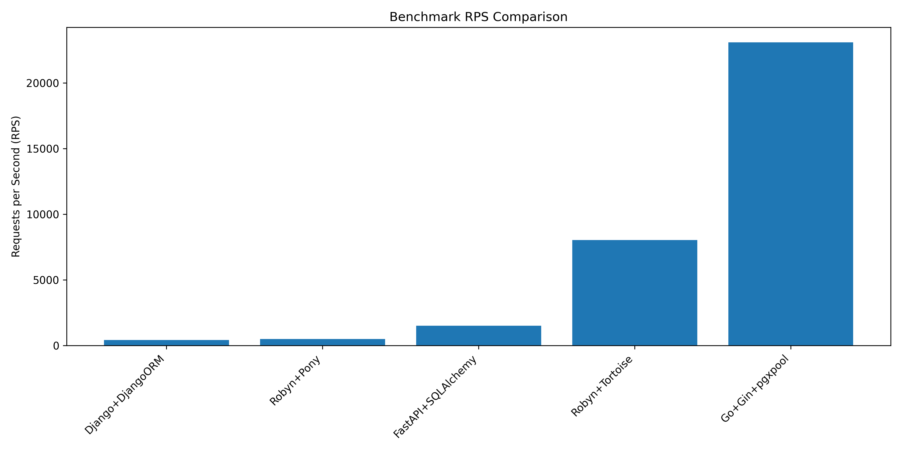

# Web Framework Performance Benchmark

This project compares the performance of different web frameworks and ORM combinations for a simple user count endpoint. The benchmark tests include popular Python frameworks (Django, FastAPI, Robyn) and Go's Gin framework, each paired with different database ORMs.

## 🏃 Tested Combinations

- Django + Django ORM
- Robyn + Pony ORM
- FastAPI + SQLAlchemy
- Robyn + Tortoise ORM
- Go + Gin + pgxpool

## 📊 Benchmark Results

| Framework + ORM | Requests/sec |
|----------------|-------------|
| Go + Gin + pgxpool | 23,085.57 |
| Robyn + Tortoise | 8,044.60 |
| FastAPI + SQLAlchemy | 1,511.57 |
| Robyn + Pony | 498.45 |
| Django + Django ORM | 430.60 |



## 🛠 Project Structure

- `django_app/`: Django application with Django ORM
- `fastapi_app/`: FastAPI application with SQLAlchemy
- `robyn_app/`: Robyn application with Pony ORM
- `robyn_tortoise_app/`: Robyn application with Tortoise ORM
- `go_gin_app/`: Go Gin application with pgxpool
- `wrk_benchmark/`: Benchmark runner using wrk

## 🚀 Setup & Running

1. Prerequisites:
   - Docker and Docker Compose
   - Make (for convenience commands)

2. Environment:
   - PostgreSQL database
   - Each application runs in its own container
   - Consistent test environment using Docker Compose
   - The database has a table called user with 1000 users in it.

3. Quick Start

    ```bash
    make install_dependencies
    make benchmark
    ```

4. Optional: Running benchmarks:
   ```bash
   # Rebuild and start specific services
   make rebuild_django
   make rebuild_fastapi
   make rebuild_robyn
   make rebuild_robyn_tortoise
   make rebuild_go_gin

   # Run individual benchmarks
   make django
   make fastapi
   make robyn
   make robyn_tortoise
   make gogini
   ```

## 🔍 Benchmark Configuration

- **Load Test Parameters**:
  - 4 threads (`-t4`)
  - 100 concurrent connections (`-c100`)
  - 10 second duration (`-d10s`)
  - Endpoint tested: `/users` (returns user count)

## 📝 Notes

- All services connect to the same PostgreSQL database
- Each framework is configured with minimal middleware and optimized for performance
- The benchmark measures a simple read operation (counting users)
- Results may vary based on hardware and specific deployment configurations

## 🤝 Contributing

Feel free to submit issues and enhancement requests!

## 📜 License

The MIT License (MIT)
 